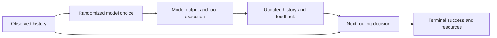

# DTR-AgentEvals

**Dynamic Agent Regimes: causal evaluation and improvement of model-switching agents.**

When an agent changes models during a task, the choice changes future outputs, tool states, errors and routing decisions. This project asks what would happen if tasks followed a specified switching policy, and whether an offline estimate agrees with fresh executions.

$$V(\pi)=E[Y^{\pi}],\qquad \Delta(\pi,\pi_0)=E[Y^{\pi}]-E[Y^{\pi_0}].$$

The proposed contribution is a sequentially randomized evaluation design with versioned model interventions, explicit support diagnostics, honest policy evaluation, and live validation. The underlying DTR and off-policy evaluation theory is established; this repository does **not** claim that renaming routing as a DTR creates a new estimator.

## Current priority: theory and paper

**24 September 2026:** the [38-page manuscript](manuscript/README.md) combines scoped theory and
proofs, synthetic development evidence, a critical coding-agent case study and both failed SWE-bench
DEV cohorts. [Read the paper PDF](manuscript/DTR_Agent_Regimes_Theory_Draft.pdf) or
[edit the LaTeX source](manuscript/main.tex). One fresh Astropy issue passed
strict evaluator controls, but the subsequent fixed-backend DEVELOPMENT
competence pair produced 0/2 eligible submissions; both models repeated failed
commands to their 24-call cap. A repaired 7B DEVELOPMENT probe then submitted
only a reproducer and left the issue unresolved. The first 14B repair1 check
was blocked before execution by a poorly calibrated swap-free rule; the
[current lead decision](docs/theory_feedback_20260924_req013_capacity_decision.md)
preserves that refusal and versions one bounded capacity-corrected check. The
historical recovery-cue live comparison remains deferred. Neither the evaluator
qualification nor this negative pair is routing/CONFIRM evidence.
Bounded local DEVELOPMENT work is allowed under verified host, source,
resource and non-overlap gates. No paid service or new CONFIRM stage is released.

**21 September design update:** a [primary-literature and official-code review](docs/literature_design_review_20260921.md)
now informs the [v2 prospective protocol](docs/experiment_protocol_v2.md): separate evaluator calibration from
history-dependent improvement, reuse mini-swe-agent/SWE-bench and a local RouteLLM baseline, and require explicit
feedback, failure, support and precision gates. The new conditional branch analysis is independently reconstructed
and [corrected](docs/theory_feedback_20260921_conditional_frame.md); primary inference remains unresolved.
These are reviewed plans and retrospective checks, with no new model or Monte Carlo execution.

The new [extension proofs](docs/theory_extensions.md) cover prospective routing opportunities, selectively measured branch contrasts, oracle allocation of branch costs, and execution-kernel sensitivity. The [independent internal review](docs/theory_review_20260919.md) records conditions, corrections, and exact checks; the [claim map](docs/paper_positioning.md) separates inherited theory from the project-specific formulation.

[Full-project readiness](docs/readiness.md) is **55% (change 0 percentage points; judgment range 45–65%)** at this checkpoint. Remaining milestones are useful validated inference/adequate comparisons, remaining statistical validation and final empirical synthesis, and independent reproducibility/author metadata/submission packaging. The stable rubric and earlier estimates are recorded in [the coordination issue](https://github.com/ykzeng-yale/DTR-AgentEvals/issues/4).

## Research package

| Start here | Contents |
|---|---|
| [Research proposal](docs/research_proposal.md) | Scientific question, contribution boundary, target trial, aims, hypotheses and manuscript abstract |
| [Literature audit](docs/literature.md) | Original 22-source audit plus a [five-source theory supplement](docs/paper_positioning.md), nearest-work comparisons, corrected source claims, search log and availability audit |
| [Theory and proofs](docs/theory.md) | Identification, policy-ratio IPW, fixed-policy EIF, exact DR remainder, inference, clusters, Bellman recursion, finite-class improvement and incremental routing |
| [Experiment protocol v2](docs/experiment_protocol_v2.md) | Literature-informed prospective design, exact-truth controls, two-decision repair study, baselines, resource and inference gates; [v0.1](docs/experiment_protocol.md) retained |
| [Executed results](docs/experiment_results.md) | What actually ran, numerical results, failed pilot attempts and limitations |
| [Next-agent handoff](docs/experiment_handoff.md) | Commands, owned artifacts, current limitations and concrete next experiments |
| [External data audit](docs/external_data_audit.md) | Direct inspection of 896 released Replay Gap records spanning 56 distinct tasks |
| [Bibliography](references/references.bib) | Verified reference metadata |

## Archived evidence

The following is the original 18 September 2026 baseline, retained as development history. Later experiment records are listed in [executed results](docs/experiment_results.md); this theory-paper update does not rerun or independently validate those newer experimental results. Current manuscript validation is recorded in [the paper status](manuscript/STATUS.md).

Original baseline:

- **Derived and numerically checked:** the core fixed-policy theory, the exact DR drift, and the additional derivative term for an unknown-behavior incremental target. The tests compare influence-function derivatives with finite differences over a fully enumerated history-dependent environment.
- **Executed synthetic experiments:** 400 main Monte Carlo replicates, three 200-replicate stress runs, and a 300-replicate finite-policy selection study. Exact dynamic-programming truth is available. These are synthetic results.
- **Executed real open-weight inference:** 320 trajectories and 960 model calls using Qwen2.5 0.5B and 1.5B through local Ollama, with pinned artifact digests, actual responses, known routing probabilities, objective arithmetic validation and recorded timing/token counts. Failed task calibrations remain in the archive. These are three exploratory pilots, not 320 independent tasks.
- **Verified:** 16 tests pass. A complete independent rerun of the 400-replicate main simulation reproduced all four numerical output files byte for byte; see [the reproduction record](results/reproduction_check.json).
- **Still required for a substantive agent study:** competent browser/coding benchmarks, larger independent live-policy validation, task-cluster inference, learned routing baselines, and the full prespecified stress grid. No claim of broad agent improvement is established.


The first two panels show the main simulation with known routing probabilities and correctly specified continuation models. The third shows a joint horizon/overlap stress test; it does not isolate horizon alone. Error bars represent Monte Carlo uncertainty in estimated coverage. All run summaries and replicate-level outputs are retained.

## Core idea



For a frozen model pool and harness, the routing action is the model configuration, and text generation is part of the downstream transition. The trajectory ratio is

$$W_t^{\pi}=\prod_{s=1}^{t}\frac{\pi_s(A_s\mid H_s)}{b_s(A_s\mid H_s)}.$$

This avoids token-level likelihood ratios **when the intervention preserves the conditional execution kernels**. It does not create support for an unseen model or changed harness. A deterministic policy has the adherence indicator in the numerator. Holding old downstream states fixed after a model switch evaluates a different intervention.

The longitudinal doubly robust score is

$$\widehat V_1(H_1)+\sum_{t=1}^{T}\widehat W_t\{R_t+\widehat V_{t+1}(H_{t+1})-\widehat Q_t(H_t,A_t)\}.$$

Point-estimate robustness does not automatically imply valid confidence intervals. The proof document states the required sampling, support and nuisance-rate conditions. The current tabular fitting implementation has ordinary all-Q-or-all-behavior robustness; it is not a fully implemented sequentially doubly robust learner or longitudinal TMLE.

## Reproduce

Requires Python 3.10+; the committed lockfile records the Python package environment. Use a new output directory for every run.

```sh
uv sync --extra test
uv run pytest -q
uv run python scripts/run_simulation.py --config configs/simulation.json --output results/simulation_replication
uv run python scripts/run_policy_learning.py --config configs/policy_learning.json --output results/policy_learning_replication
```

For the real model pilot, see [the handoff](docs/experiment_handoff.md). It requires a local Ollama service and the two exact model artifacts; no paid API is used. New runs verify artifact digests. Models are downloaded separately and are not committed to GitHub.

To repeat the public data audit:

```sh
uv run python scripts/audit_replay_gap.py --output results/replay_gap_audit_replication
```

To rebuild the plot from the archived summaries, install the plot extra and run `scripts/plot_simulation.py`. The source release and local raw-model outputs remain distinct from synthetic simulation. Root and branch data are never mixed as independent tasks.

## Collaboration rules

Read [AGENTS.md](AGENTS.md) before continuing experiments. Preserve completed runs, state what has and has not been executed, keep task families together across folds, pin model/harness configurations, and do not publish private data. Third-party model and dataset licenses are documented in the manifests and source audit. The project currently does not grant an additional repository-wide software license.
