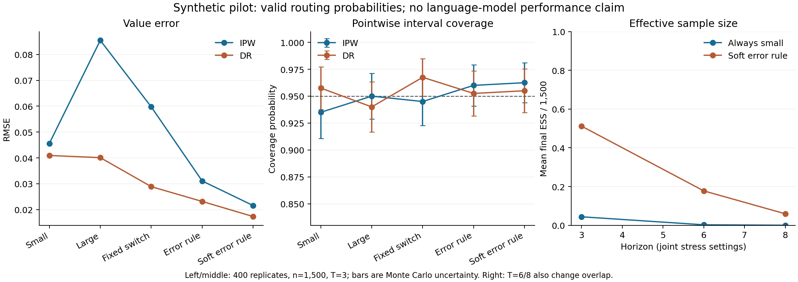

# Completed experiments and their interpretation

The original result sections below were generated on 2026-09-18; later checkpoints are dated explicitly. Synthetic results, real open-weight model observations, and remaining publication work are separated. The tests establish implementation identities and numerical correctness; they do not replace statistical assumptions or benchmark validation.

**Latest review, 20 September 2026, 04:24 UTC cycle:** all 800 branch completions are now published at `d4997c6` and independently reconciled as saved records. The new 42-task analysis changes the population and weights, so uncertainty for the original full-prefix contrast remains unresolved. See [the completed-branch review](theory_feedback_20260920_branch.md). The earlier live-policy review at `ac3ca83` remains valid within its stated limits; historical snapshots below are dated explicitly.

## Coding-study checkpoint: 19 September 2026, 22:00 UTC review cycle

At commit `035d245`, two independent internal reviewers inspected the committed randomized log: **4,488 unique episodes, 561 tasks, eight episodes per task, and 6,063 durable decision records**. TRAIN has 231 tasks / 1,848 episodes; CONFIRM has 330 tasks / 2,640 episodes, with no task overlap. Episode assignments agree with the frozen design, and no infrastructure-error episode is recorded. The learned-policy artifact is frozen and its source code uses TRAIN only. These are independently checked artifact and source-code properties, not fresh execution or independently rescored hidden-test results.

No completed live-policy or branch results are committed at this checkpoint. The subsequent workstream note at `f3aa436` reports live collection running; that stage is not independently validated here. No new model run, simulation sweep, performance ranking or fitted policy-effect estimate was produced by this review. One TRAIN episode has documented path redaction; the task source is absent from this checkout, so original transcript reconstruction and restoration remain unverified here. See the [theory feedback and analysis gates](theory_feedback_20260919.md) for the finite-certificate, completeness, restoration and shared-prefix variance issues that must be resolved before final interpretation. Earlier mock-only statements below describe their dated historical stage.

## Synthetic longitudinal evaluation

The main run used 400 independent Monte Carlo replicates, 1,500 trajectories per replicate, horizon 3, and three-fold cross-fitting. Baseline difficulty and current failure form four states. Previous model choice changes the next failure state; that state changes both future routing probabilities and future success. The terminal reward is success minus 0.06 per use of the stronger model. Known logging probabilities are bounded away from zero. Five fixed target policies were evaluated against exact Bellman values and separately generated 200,000-trajectory on-policy checks.

| Policy | Exact utility | Independent on-policy mean | Monte Carlo SE |
|---|---:|---:|---:|
| always_small | 0.315901 | 0.315930 | 0.001040 |
| always_large | 0.532492 | 0.532665 | 0.001012 |
| fixed_switch | 0.573582 | 0.574395 | 0.001030 |
| failure_escalation | 0.450386 | 0.450101 | 0.001137 |
| soft_escalation | 0.447130 | 0.447871 | 0.001129 |

`fixed_switch` at horizon 3 is small → large → large; failure-escalation selects the stronger model whenever the current failure indicator is 1. Soft escalation selects it with probability 0.1 after success and 0.9 after failure. These simulator policies are not identical to the pilot initialization rules, which start the failure policy with the small model.

With correct tabular Q models and known logging propensities:

| Policy | IPW RMSE | DR bias | DR RMSE | Nominal DR 95% coverage |
|---|---:|---:|---:|---:|
| always_small | 0.0456 | -0.0013 | 0.0409 | 0.958 |
| always_large | 0.0855 | -0.0019 | 0.0401 | 0.940 |
| fixed_switch | 0.0597 | 0.0006 | 0.0289 | 0.968 |
| failure_escalation | 0.0311 | 0.0033 | 0.0232 | 0.953 |
| soft_escalation | 0.0216 | 0.0025 | 0.0173 | 0.955 |

Nominal coverage near 0.95 has Monte Carlo SE about 0.011 with 400 replicates. Every replicate, summary and diagnostic is saved in [`results/simulation`](../results/simulation/). G-computation point estimates are provided, but no unsupported plug-in confidence intervals are fabricated. Uncertainty for its estimated Q functions was not implemented.

The misspecification experiment omits the evolving failure variable from Q fits and/or replaces the behavior probabilities by an incorrect constant 0.5. The following always-small results illustrate the estimator robustness and its limits:

| Q fit | Propensity | DR bias | DR RMSE | Nominal interval coverage |
|---|---|---:|---:|---:|
| correct | known | -0.0013 | 0.0409 | 0.958 |
| misspecified | known | -0.0013 | 0.0472 | 0.958 |
| correct | misspecified | 0.0021 | 0.0325 | 0.953 |
| misspecified | misspecified | 0.0888 | 0.0946 | 0.258 |

**Inference caveat:** with wrong propensities and consistent estimated Q fits, DR consistency does not imply validity of the empirical score-only standard error. First-order Q estimation can remain in the drift. Coverage in wrong-propensity cells is descriptive, not a claimed confidence-interval theorem. With known propensities and stable, possibly misspecified Q limits, score inference has a different and more favorable justification. The tabular backward regression implemented here claims the all-Q OR all-propensity consistency guarantee; arbitrary stagewise multiple robustness is not established for these fitted nuisances.

## Horizon and overlap stress

Each stress condition uses 200 replicates. The horizon-8 case also lowers the propensity floor from 0.15 to 0.01; evolving stage-dependent routing changes the propensity distribution. These conditions expose practical failures and do not isolate horizon from overlap effects.

| Condition | Policy | Median final-stage ESS | DR RMSE | Nominal coverage | Zero-ESS replicates |
|---|---|---:|---:|---:|---:|
| h3_n250 | always_small | 12.3 | 0.1159 | 0.885 | 0/200 |
| h3_n250 | failure_escalation | 73.2 | 0.0555 | 0.945 | 0/200 |
| h3_n250 | soft_escalation | 128.3 | 0.0416 | 0.960 | 0/200 |
| h6_n1500 | always_small | 4.0 | 0.4292 | 0.905 | 0/200 |
| h6_n1500 | failure_escalation | 88.4 | 0.0494 | 0.975 | 0/200 |
| h6_n1500 | soft_escalation | 268.4 | 0.0303 | 0.940 | 0/200 |
| h8_n1500 | always_small | 1.0 | 0.6359 | 0.860 | 97/200 |
| h8_n1500 | failure_escalation | 21.1 | 0.1107 | 0.950 | 0/200 |
| h8_n1500 | soft_escalation | 89.2 | 0.0533 | 0.950 | 0/200 |

The always-small target has median terminal ESS 1 and no target-compatible terminal trajectories in 97/200 horizon-8 replicates. Its DR RMSE is approximately 0.636 and nominal coverage is 0.86. Correct identification and nuisance specification do not create information where practical trajectory overlap is absent. Stochastic targets help here but are different interventions; they are not interchangeable replacements for unsupported deterministic policies.

## Honest policy selection

A separate 300-replicate simulation selected from the five prespecified policies using 750 training trajectories, then evaluated the selected policy with 1,500 independent trajectories. Mean training optimism was 0.0196; independent evaluation bias was -0.0017, RMSE 0.0342, and nominal coverage 0.940. Mean regret relative to the best policy in this finite menu was 0.0115. The mean true utility gain over always-small was 0.2462 in this constructed environment. This is a demonstration of honest evaluation, not evidence that an actual LLM router has been improved.

Selection counts: `{'always_small': 0, 'always_large': 81, 'fixed_switch': 218, 'failure_escalation': 1, 'soft_escalation': 0}`. Raw results: [`results/policy_learning`](../results/policy_learning/).

## Actual open-weight local-model pilots

Ollama 0.21.2 ran Qwen2.5 0.5B and 1.5B locally on an Apple M2 Max with 32 GB memory. Both selected model cards specify Apache-2.0 weights ([0.5B license](https://huggingface.co/Qwen/Qwen2.5-0.5B-Instruct/blob/main/LICENSE), [1.5B license](https://huggingface.co/Qwen/Qwen2.5-1.5B-Instruct/blob/main/LICENSE)). Registry manifests, full model metadata and exact content digests are saved. No upstream Hugging Face source commit is claimed to have been recovered from the quantized registry artifact.

Each trajectory has three model decisions. The logger chooses the large model with probability 0.5 initially, then 0.75 after failure and 0.25 after success. Model history is transferred intact. The validator supplies truthful correctness feedback; after failure it reveals one partial multiplication result. The final endpoint is last-stage correctness. All stages execute, including after success, so switching can spoil an earlier correct answer. Four deterministic policies were run prospectively on evaluation tasks that are disjoint from logging tasks within each run.

The resource proxy is 0.01 per small call and 0.03 per large call; it is not dollars or energy. Recorded token counts and wall times are separate measurements. Loading/caching and task order affect timing. Every raw prompt, response, probability, seed, reward and model digest is retained.

| Pilot | Logged trajectories | Prospective policy trajectories | Actual model calls | Correct stage answers | Purpose/result |
|---|---:|---:|---:|---:|---|
| 1: modular, answer-only | 32 | 48 | 240 | 5/240 | Severe floor effect |
| 2: products, answer-only | 64 | 96 | 480 | 1/480 | Severe floor; retained irrelevant mod definition |
| 3: products, reasoning enabled | 32 | 48 | 240 | 194/240 | Exploratory harness calibration |

The first two pilots had zero final successes under every prospective policy. The second reused the answer-only scaffold and retained an irrelevant definition of mod. Both failures are preserved rather than removed. The third enabled explicit arithmetic reasoning in an unexecuted JSON string and removed the irrelevant definition. Prompt and task changes were driven by observed feasibility results, so these are not prespecified confirmatory experiments.

Some small-products task seeds are reused across the second and third calibrations. Within-run logging/evaluation separation holds, but these samples are not a fresh confirmation after harness selection. A publication study requires newly generated tasks disjoint from all calibration data.

Third-pilot direct prospective outcomes:

| Regime | Final successes | Mean proxy utility | Median trajectory wall seconds |
|---|---:|---:|---:|
| logging | 24/32 | 0.696 | 3.78 |
| always_small | 12/12 | 0.970 | 3.87 |
| always_large | 7/12 | 0.493 | 4.78 |
| fixed_switch | 12/12 | 0.930 | 7.39 |
| failure_escalation | 12/12 | 0.970 | 3.94 |

Pilot off-policy results are especially limited by sample size:

| Target | IPW proxy utility | Terminal ESS | Target-compatible terminal trajectories |
|---|---:|---:|---:|
| always_small | 1.080 | 10.0 | 10/32 |
| always_large | 0.279 | 2.3 | 3/32 |
| fixed_switch | -0.051 | 3.0 | 3/32 |
| failure_escalation | 1.063 | 13.0 | 13/32 |

**Interpretation:** these small pilot samples cannot establish policy superiority or validate asymptotic intervals. One first-pilot target had no compatible terminal trajectories; the summary explicitly flags it. Prospective differences can be noisy, and estimated importance-weight values need not lie in the outcome range. Paired task bootstrap intervals are supplied only as exploratory descriptions, without multiplicity adjustment or small-sample guarantees. No Q or DR result is fit to these tiny, high-dimensional model histories.

The raw-log audit reparses outputs and checks action probabilities, action/model alignment, model digests, stage order, previous correctness, exact reference answers, reward/cost identities, terminal outcomes and within-run task separation. All response content is treated as untrusted text. The collector currently persists events after each complete trajectory; it is not a durable pre-action or crash-safe production logger.

## Verification and remaining scope

The test suite checks complete path enumeration for IPW and both DR robustness branches, the necessity of the target-policy numerator, exact truth against independent policy simulation, reproducibility, positivity validation, strict response parsing, arithmetic answers, sequential feedback, and no reference answer in the initial fixture prompt. Additional theory tests verify finite-difference influence-function identities and the exact drift identity. All 16 tests passed in the final run before reporting.

See [`experiment_handoff.md`](experiment_handoff.md) for runnable commands, metadata interpretation, inference limitations, and concrete publication-scale follow-up. All completed runs are available under [`results`](../results/); none should be labeled a completed external-benchmark study.

An independent final-source rerun repeated all 400 main simulation replicates. The replicate table, summary, exact-truth/on-policy check and diagnostic files were byte-identical to the archived outputs, despite the recorded NumPy versions differing (2.4.1 versus 2.5.3). The [reproduction record](../results/reproduction_check.json) includes output and code hashes. This verifies this run; it is not a guarantee across arbitrary software/hardware changes.

## Experiments workstream: design-efficiency simulation (added 18 September 2026)

*Written by the experiments agent; synthetic evidence only. Full write-up, table, figure and limitations: [`experiments/README.md`](../experiments/README.md). Raw replicates, manifest (seed, arguments, code sha256) and summary: [`results/sim/`](../results/sim/).*

Run: `experiments/sim/run_sim.py --reps 1000 --ci-reps 200 --workers 4` — 5,000 Monte Carlo replicates (1,000 at each of n = 300, 600, 1,200, 2,400, 4,800 episodes), 1,359 s on an Apple M5. The generator is a separate two-stage coding-agent simulator (`experiments/sim/synth_agent.py`) with truth from 400,000-task on-policy rollouts. Three base rates are calibrated to a real 591-task MBPP+HumanEval run; **the treatment-effect mechanism is planted, not observed.**

Observed: (i) IPW and cross-fitted AIPW bias at most 0.0014; task-cluster bootstrap 95% intervals covered 0.925–0.960 over 200 replicates per cell (Monte Carlo SE about 0.015). (ii) At equal total episodes, one sequentially randomized experiment estimated each of 12 embedded scaffolds with 1.67–1.72× lower RMSE than one arm per scaffold, and the scaffold it picked had lower true regret at every n (0.0017 vs 0.0072 at n = 4,800). (iii) A Q-learned tailored regime beat the best fixed scaffold in 41.5% / 62.8% / 81.6% / 91.1% / 94.8% of replicates at the five sample sizes; **at n = 300 it was worse on average.** (iv) At equal compute, forked replay of all feasible rescue arms reduced the variance of a stage-2 contrast by 2.1–2.3×.

Limitations: one mechanism, two stages, no misspecification/drift/weak-overlap cells, exact simulated state restoration. The efficiency factor in (ii) is specific to 12 regimes sharing a 2×2×3 randomization; it is not a general constant. This run does not use `src/dtr_agent_evals/simulator.py` and does not replace the S1 grid in the protocol.

As of this **18 September** entry, the code-routing study on real open-weight models (ladder L1–L3) was **implemented and dry-run with a mock model only**. The dated 19 September checkpoint above supersedes that execution status; it does not convert these synthetic results into real-agent evidence.

## Experiments workstream: S1 crossed grid on the reference simulator (added 18 September 2026)

*Written by the experiments agent; synthetic evidence only. Tables: [`results/s1_grid/grid_report.md`](../results/s1_grid/grid_report.md); interpretation and caveats: [`experiments/README.md`](../experiments/README.md#s1--crossed-grid-on-the-reference-simulator-s1_grid).*

Run: `experiments/s1_grid/run_grid.py --workers 4 --replicates 1000`, which calls the unchanged `scripts/run_simulation.py` once per cell with configs in `configs/s1_grid/` (seed 20260918, n ∈ {250, 1000, 4000} × horizon ∈ {2, 5, 10} × overlap floor ∈ {0.5, 0.2, 0.05}, five policies, four nuisance specifications, 200,000-episode on-policy truth check). 27 of 27 cells completed; no numerical failures; no clipping.

Observed, with known propensities and correct tabular Q: mean DR 95% coverage over policies was 0.94–0.95 at horizon 2, 0.92–0.95 at horizon 5, and 0.76–0.95 at horizon 10; the worst single policy at horizon 10 under confounded logging covered 0.319 (n = 250) to 0.827 (n = 4,000), with DR RMSE up to 5.7 on a return bounded in about [−0.6, 1]. Uniform logging restored horizon-10 coverage to 0.934 / 0.951 at n = 1,000 / 4,000. With both nuisances misspecified mean |bias| was 0.019 / 0.049 / 0.246 at horizons 2 / 5 / 10.

Evaluation cost: on-policy evaluation with the same n episodes split across the five policies had RMSE 1.13–1.43× that of DR from one shared uniform log at horizon 2, but only 0.41–0.70× at horizon 5 and 0.07–0.21× at horizon 10. **The "lower evaluation cost" hypothesis of theory §8 is supported at horizon 2 and contradicted at horizons 5 and 10 for a five-policy class.**

Limitations: one transition law; floors 0.05 and 0.2 are nearly the same logger in this simulator because the clip rarely binds (identical cells at horizon 2), so overlap is effectively varied only as confounded-versus-uniform; non-Markov, censoring, drift and estimated-propensity cells of protocol §3.2 are not run.

## Code-routing study on open-weight models: live results reviewed 20 September 2026

*Results first published by the experiments workstream in `ac3ca83`; interpretation corrected during the 20 September theory review. Raw records, manifests and analysis CSVs remain under [`results/code_routing/`](../results/code_routing/). Protocol and freeze hashes: [`experiments/code_routing/protocol.md`](../experiments/code_routing/protocol.md). Later README/figure repairs are accepted where listed in [the completed-branch review](theory_feedback_20260920_branch.md); remaining claims and the branch comparison still need correction. This section supersedes the original stronger calibration, equivalence and combined-improvement claims.*

The published design and manifests describe Qwen2.5-3B-Instruct and Qwen2.5-7B-Instruct (Q4_K_M, llama.cpp) on MBPP-sanitized + HumanEval with hidden-test scoring in a macOS Seatbelt sandbox. The archives contain **4,488 randomized-log episodes** (561 TRAIN+CONFIRM tasks × 8) and **3,960 live episodes** (6 frozen policies × 330 CONFIRM tasks × 2). Independent checks confirm the complete live episode-ID set and task/policy/run metadata. No infrastructure errors or retries are recorded; the live records include one validation timeout and three truncated generations. These are saved-record checks, not independent reruns of hidden tests, sandbox execution or model serving.

**Offline–live agreement is mixed descriptive evidence.** Independently reconstructed task-paired means, standard errors and intervals agree with the saved calibration table. Five of six nominal 95% utility-difference intervals include zero; this does not establish equivalence, calibrated confidence-interval coverage or the absence of bias. `class_tailored` has a nominal discrepancy of −0.0372 (95% interval −0.0695 to −0.0049), which warrants investigation. No causal explanation for it is established, and the six pointwise intervals are not a simultaneous calibration test. Spearman rank agreement is 0.886, and reported OPE/live standard-error ratios are approximately 0.91–1.07.

**Three policies meet the written primary utility improvement rule versus `always_small`.** `always_large`, `learned`, and `soft_escalation_d2` have positive Bonferroni OPE lower limits and positive live contrasts. `class_tailored` and `escalate_after_first_failure` do not satisfy its OPE criterion. `large_then_small` and `soft_escalation_d4` satisfy the OPE criterion only: neither has a live arm, so the required live-sign check cannot be claimed. The inference uses the stated task-level asymptotic assumptions; it is not finite-sample certification. Success is a secondary outcome.

**The secondary learned-versus-always-large comparison is inconclusive.** The utility contrast is +0.0175 (95% interval −0.0157 to +0.0507) offline and **−0.0050 (−0.0271 to +0.0171)** live. The live success contrast is **−0.0076 (−0.0292 to +0.0141)**. These intervals permit effects of either sign and establish neither superiority, equivalence nor noninferiority. The learned policy made 762 versus 858 large-model calls, an observed 11.19% reduction, with mean success 0.7091 versus 0.7167. Its total calls were higher: 880 versus 858. The resource measures and uncertain outcome differences must be reported together; “same quality” is unsupported. The policy-level success/call plot is descriptive, not a causal dose-response or proven efficient frontier.

**Resource accounting.** CONFIRM logging used 3,662 calls, TRAIN logging 2,401, and the complete randomized log 6,063. Six fresh live-policy arms used 5,504. The 3,662-versus-5,504 comparison excludes common training; adding the observed training cost to both pathways gives 6,063 versus 7,905. These are call counts for specified portions of this study, not complete end-to-end costs or a general equal-precision efficiency result. Development, test generation, fitting and branch costs must also be accounted for. Calls, tokens, latency and dollars are distinct units.

**Diagnostics and controls.** The largest disagreement among IPW, DR and g-computation is below 0.016 for utility and approximately 0.0167 for success. No fitted or held-out Q lookup requires a fallback in the checked folds. Deterministic targets have maximum weight 8 and final padded-stage ESS approximately 771–903; stochastic targets have ESS approximately 2,286–2,528 and maximum weights 1.78–2.56. These ESS values describe weighted episodes, including absorbed trajectories, not independent task counts or the third-stage risk set. Better overlap alone does not prove cheaper evaluation. The −0.484 naive association compares episodes reaching a second decision with episodes stopping after one, irrespective of model switching. The deliberately wrong-propensity estimate 2.015 is for **success**, not utility.

**The Theorem 5 output is a hypothetical scale calculation, not a valid certificate for the reported cross-fitted scores.** The values M = 48.41 and half-width approximately 18.1 use an independent-evaluation argument whose external-fit condition is not supplied by fitting Q on other CONFIRM folds. This applicability issue precedes whether the bound is useful. The asymptotic primary rule is separate. A separately evaluated TRAIN-only nuisance fit or a justified foldwise construction is needed before presenting a finite-sample certificate; a variance-adaptive replacement would require further theory.

**Branch and integration status at the earlier `ac3ca83` snapshot.** Only 135 of 800 planned branch continuations were then committed. The later completed-cohort review follows below; record completeness does not by itself resolve restoration enforcement or joint inference. Other limitations include one coding-benchmark family, one model pair, K = 3 with absorption on **visible-validator pass**, compressed tabular states, benchmark-adapted visible tests and unknown model memorization. Reference-solution certification does not establish validity for every correct candidate. One live trace is redacted; original task inputs, original unredacted bytes and host execution are not independently verified here. Results are not yet integrated into the manuscript PDF.

*(Experiments workstream, 19 September 2026, responding to the review above.)* The three corrections are accepted.
The wrong-propensity control value 2.015 is for **success**, not utility, and the IPW/DR/g-computation disagreement
reaches 0.0167 on success rather than staying below 0.016; both are fixed in `experiments/README.md`. On Theorem 5,
the review is right that applicability precedes usefulness: the reported M = 48.4 and half-width 18.1 assume
nuisances fitted on data independent of the evaluation sample, which cross-fitting **within** CONFIRM does not
supply, so the number is a scale calculation and not a certificate for the scores reported here. It is retained only
as an indication of magnitude, and the improvement decisions rest on the asymptotic Bonferroni rule. The branch
finding was also correct at the time it was written: that snapshot did contain only 135 of 800 continuations. The
cause was an operator error in publishing, not a partial run, and it is documented in protocol section 11; the
completed audit follows.

Limitations: one benchmark family, one model pair, K = 3 with absorbing success, a tabular state, and visible checks certified against reference solutions (so "no false alarms" holds for reference-equivalent code, not for every correct program). The branch audit of restored prefixes was still executing when this section was written and is reported separately.

### Completed branch cohort (workstream report, corrected in the 04:24 UTC review)

200 first-failure prefixes sampled with known probability (0.355) from the completed confirm log, transcripts restored, both models continued from the identical saved state with two fresh seeds each: 800 continuations over 103 tasks, 0 infrastructure errors.

All **800** records contain successful transcript-hash and tool-result restoration flags, and independent checks reconcile their initial prefix hashes with the recorded parents. The monitor has not independently reexecuted restoration or verified the complete runtime state. Observed disagreement between two fresh continuations of the same recorded state/model is **8.0%**; it is not a universal or irreducible noise bound.

The independently reconstructed prefix-weighted branch estimate is **0.120000**; the pooled log Hájek estimate is **0.134654**, giving **−0.014654**. The published standard errors 0.0320 and 0.0474 and the independence-based difference interval are archived outputs; no validated joint interval for the full-prefix comparison is established here. The later 42-task calculation gives −0.091440, but it retains only 98/200 sampled prefixes and 240/564 source prefixes and replaces prefix weighting with equal task weighting. It is an exploratory selected-task comparison, not a correction of the original estimate's covariance. The [review and exact ratio derivative](theory_feedback_20260920_branch.md) give the target-preserving starting point; design-aware uncertainty remains to be completed.

The claimed 2.19 variance ratio compares published estimates at **unequal recorded costs**, so it does not establish replication of an equal-compute simulation result. The 1,434 retained continuation calls are approximately 39% of the 3,662 CONFIRM-log calls, but the comparison omits prefix acquisition and unrecovered execution. Neither general efficiency nor equivalence of the two estimates is established. The target remains a first-failure continuation contrast under the logger's prefix distribution, not a whole-policy value.

The retained records report zero foreign GPU load, one validation timeout, no hidden-test timeouts and three truncated generations. There are **13,001 calls attached to retained log/live/branch episodes**, or **13,164 including the 163-call pilot**. These totals exclude environment-construction calls and unrecovered original executions; they are not total physical compute.

Protocol §11 **reports** loss of 665 original completions during publication/rebase and recovery using the same frozen IDs/seeds. The archive independently confirms preservation of 135 earlier rows and addition of 665 rows under the recovery invocation, but cannot establish the missing outcomes, their invisibility or absence of inferential impact. Five earlier durable decisions across four recovered IDs remain alongside replacement decisions; invocation must be part of the key. Zero recorded error-based retries does not mean zero repeated execution. The new publication verifier improves ID accounting but still needs torn-tail, duplicate, provenance and writer-race checks; see the review's acceptance criteria.

### Corrections to the sections above (experiments workstream, 20 September 2026)

Applied after the review in [`theory_feedback_20260920.md`](theory_feedback_20260920.md). Original records are unchanged; these are analysis and reporting corrections, made after the stages completed and before any manuscript integration.

1. **The improvement claim was overstated.** Only six of the nine frozen policies were executed live, so only those six can satisfy a rule that requires a live contrast. The rule is met by `always_large`, `learned` and `soft_escalation_d2`. `large_then_small`, `soft_escalation_d4` and `escalate_after_second_failure` have offline estimates only; the earlier text wrongly listed the first two as passing. No improvement is claimed for a policy that was never run.
2. **Equivalence wording removed.** The learned regime's failure to beat `always_large` is a failure to detect a difference, not evidence of equality: the live success interval [−0.029, +0.014] is compatible with either being better by up to about 0.03. The call-count difference (1.15 versus 1.30 large calls per episode) is descriptive of what the two policies spent, not an established causal saving at matched quality.
3. **Figure defect fixed.** The success panel annotated the *utility* difference (−0.005) instead of the success difference (−0.008 [−0.029, +0.014]), and fixed axis limits clipped the calibration intervals; limits are now data-driven.
4. **Evaluation cost separated from total collection cost.** The 3,662 calls that support all nine policies are the CONFIRM portion of the log; the complete log cost 6,063 calls, the extra 2,401 being TRAIN calls spent on policy learning rather than evaluation.
5. **Branch/log linkage repair remains incomplete (superseded by the 04:24 UTC review).** The workstream produced a paired 42-task result of **−0.091, nominal interval [−0.208, +0.025]** in `experiments/tools/linked_branch_uncertainty.py`. Independent review found that task selection and weighting changed the target. This output must be labeled exploratory and cannot replace uncertainty for the original pooled contrast. A correlation on the selected subset does not repair the full-prefix comparison.
6. **Theorem 5** remains reported as a scale calculation, not a certificate, for the applicability reason given in the earlier review.

The complete 800-continuation cohort now permits independent record reconciliation. All stored restoration flags are true; those recorded checks should remain distinct from independent runtime restoration or a claim of universal replayability.

### Target-preserving repair reviewed at `29ee443` (06:04 UTC cycle)

The new analysis correctly preserves the full pooled difference **−0.014654**. Independent reconstruction reproduces
its squared-derivative scale **0.048386**, but neither this algebra nor a derivative check validates the displayed band
as a 95% interval. The earlier 42-task result remains exploratory. The [current review](theory_feedback_20260920_sampling.md)
distinguishes the fixed-frame and population targets, checks the covariance explanation using a common calculation,
and lists remaining reporting contradictions. A new [conditional sampling proof](theory_branch_sampling.md) supplies
only the branch component of variance under explicit execution assumptions; the full source-frame/log component
remains open. No new empirical observations or model executions were added.

The publication gate now rejects several earlier defects, including torn tails and duplicate completions. However,
independent fixtures show that false/missing restoration evidence, missing metadata and incomplete invocation/decision
linkage can still pass. These are checker gaps, not new defects found in the actual saved cohort. All 19 non-analysis
code-study artifacts are byte-identical to `d4997c6`; the independent cohort audit remains a separate evidence layer.

### Reporting and gate revision reviewed at `6f92026` (07:50 UTC cycle)

No empirical numbers or raw records changed; only the reporting figure changed under the results directory.
Independent deterministic fixtures confirm that 12 of the earlier 14 publication-check bypasses now reject. Parent
hash/source identity and further isolated reference-data/linkage cases remain open, and invocation-blind matching
can reject valid historical recovery rows. The [review](theory_feedback_20260920_integration.md) records the exact
scope and remaining contradictory README/figure text. All 19 non-analysis artifacts remain unchanged. The conditional
sampling proof is now in the manuscript; this advances the theory paper without validating the empirical joint band
or inserting empirical results into the PDF.
