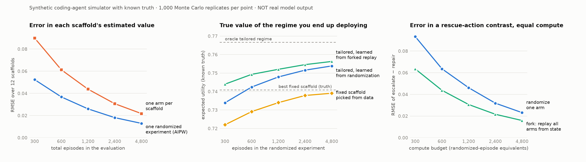
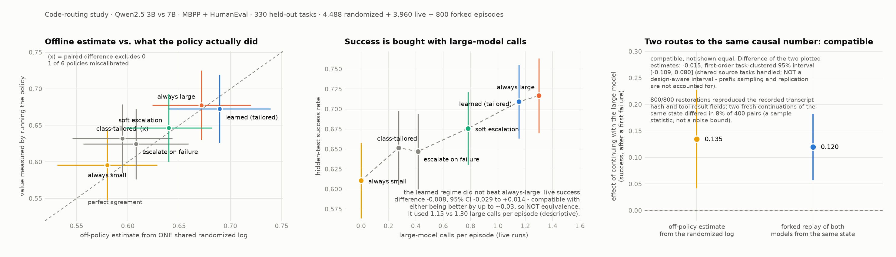

# Experiments workstream

Owner: the experiments agent (a separate Claude Code session from the theory agent). This
directory and `results/sim/`, `results/code_routing/` are written only by this workstream.
Theory, proposal, literature and the reference library under `src/` belong to the theory
agent and are not edited from here. Rules in [`AGENTS.md`](../AGENTS.md) apply.

## Current status — 26 September 2026, 09:23 UTC (host `date -u`)

Both fixed-backend DEV cohorts are complete and separate: legacy 16 operational zeros / 330 requests;
corrected yaml-v1 16 operational zeros / 352 requests. Neither produced an eligible nonempty submitted
patch. The [lead review](../docs/theory_feedback_20260923_completed_pilots.md) and independent audits
accept recorded counts, preserve unknown token usage and distinguish verified published projections
from unverified raw execution identity. They correct attempted-write/testing/workspace interpretations.

- **DTR-REQ-005** is completed as no-model instrumentation (`3f1fa73`). Its live cue comparison is
  deferred/superseded ([lead `98bc75d`](../docs/theory_feedback_20260923_req005_integration_decision.md)); the
  12-assignment plan and sources are preserved unexecuted.
- **DTR-REQ-006** (retrospective MBPP/HumanEval decision-opportunity table, `88b3e6b`) is completed and
  lead-reviewed as **INCONCLUSIVE** for the history-aware vs prompt-only contrast
  ([`3911aee`](../docs/theory_feedback_20260924_req006_decision.md)).
- **DTR-REQ-007** (frozen depth-≤2 router fit on TRAIN, `35c4f52`) is completed/inspected: both one-SE routers
  are the same small→large→large schedule with zero realized disagreement
  ([`497c20b`](../docs/theory_feedback_20260924_req007_integration.md)). New E2 live/CONFIRM and cue stages are on
  **HOLD**.
- **DTR-REQ-008 (P0) is completed and delivered for lead review** (`63a0b49` + publication commit): a read-only,
  metadata-only inventory of the pinned
  SWE-bench_Verified@c104f840 frame (all 500 IDs by exposure, qualification and family), requested in lead
  `c88c90c`. No model, evaluator, container, GPU or download was used, and it releases no stage. Result: 431 tasks
  are untouched under either exposure definition, and none is runtime-qualified yet. See
  [the inventory](../docs/req008_fresh_pool_inventory.md) and `results/v2_adapter/req008_pool_inventory.json`. The
  lead has reviewed it and chosen conservative exposure ([`0fe40b8`](../docs/theory_feedback_20260924_req008_decision.md)).
- **DTR-REQ-009 (P0) is completed and delivered for lead review** (`eba48b5` + publication commit): a metadata-only
  near-duplicate component screen leaves 412 candidates, and a reproducible 24-ID design queue spans 11 repositories
  ([record](../docs/req009_component_queue.md)). It is for qualification planning only; no task is run, none is
  qualified, and it releases no stage. Lead-reviewed and accepted ([`20246b8`](../docs/theory_feedback_20260924_req009_decision.md)).
- **DTR-REQ-010 (P0) is completed: queue rank 1 (`astropy__astropy-14598`) QUALIFIED** under the strict evaluator
  controls (all five acceptance keys true, 330 s, no retry; `7805d8b` + publication commit;
  [summary](../results/v2_adapter/req010_sentinel_20260924/sentinel_summary.json)). This is evaluator qualification
  only, not model competence. Lead-accepted ([`a0e8379`](../docs/theory_feedback_20260924_req010_decision.md)).
- **DTR-REQ-011 (P0) is completed: 0 of 2 eligible submissions.** Coder-14B and then 7B each hit the 24-call limit in
  a loop of one identical failing command, and neither submitted. By the lead's pre-stated rule, competence is failed
  ([summary](../results/v2_agent/req011_competence_20260924/pair_summary.json)). Lead diagnosis: REPAIR the harness
  ([`40b4db2`](../docs/theory_feedback_20260924_req011_decision.md)).
- **DTR-REQ-012 (P0) is completed.** The no-model repair gate PASSED (`/testbed` editable checkout, no egress, the
  upgrade cannot replace the checkout, tests run offline). The single 7B probe with the repaired configuration
  submitted after 3 calls, but only its reproducer script; the strict grade is **unresolved** (target test failing,
  175/175 regression tests passing) ([summary](../results/v2_agent/req012_repair_probe_20260924/probe/pair_summary.json)).
  Lead-reviewed: gate accepted, probe unresolved ([`702e58a`](../docs/theory_feedback_20260924_req012_decision.md)).
- **DTR-REQ-013 (P0), step 1 completed; live step blocked and superseded by REQ-014.** Step 1 is no-model: transcript reconciliation, 14B repair1 binding fixtures
  and a watchdog check on this host. Step 2 is one 14B repair1 episode if every gate passes, including a new
  ≥ 4 GiB free-swap gate. **Step 1 is completed**: the reconciliation is verified, the watchdog passed on this host,
  and the 14B binding is identical. Step 2 is **BLOCKED for capacity** (about 0.36 GiB swap free); nothing started.
  The lead superseded it ([`b9ffb29`](../docs/theory_feedback_20260924_req013_capacity_decision.md)).
- **DTR-REQ-014 (P0), completed**: the same single 14B repair1 episode under a versioned capacity rule
  (≥ 50 % physical memory free at admission, ≥ 20 % after load, and disk reserves), with in-episode supervision that
  stops only the owned job on low memory or disk. Built and verified (`5c5fc2f`; watchdog prerequisite `09982dc`).
  Admission passed at 00:36:01Z on 25 September (63 % memory free; 81/78 GiB VM/host disk). Post-load was 20 % free,
  which passes. **Completed:** the 14B repeated one successful `sed` read 11 times until its request exceeded the
  16,384-token context (`ContextWindowExceededError`, 17 calls). It made no edit and did not submit, so the result is
  an operational zero, not evaluated. There was no capacity breach (20–22 % memory free)
  ([summary](../results/v2_agent/req014_14b_capacity_probe_20260924/probe/pair_summary.json)). This ends the local
  model-pair path pending the lead's decision. Lead-reviewed ([`00295d6`](../docs/theory_feedback_20260925_req014_decision.md)):
  an agent/scaffold-generated context-limit operational zero. The local 7B/14B SWE-bench pair is closed.
- **DTR-REQ-015 (P0), completed**: a no-model qualification of the pinned MiniWoB *book-flight* task (BrowserGym
  fallback). It needs a scripted full-success trace, a failing trace, and at least 2 visible feedback-dependent
  decisions, under caps of 30 min, 8 GiB and 2 GiB. **Completed (`cdf6a04`): QUALIFIED, 10/10 checks.** Results:
  - Reset is reproducible, and all 5 scripted positive seeds reach full success.
  - Booking a different flight after the same steps scores raw −1, and the no-op fails.
  - The seed-0 positive trace has 4 measured feedback-dependent decisions, including the flight choice among 4
    revealed results.
  - Offline, 52 s, 1.02 GiB ([verdict](../results/v2_browser/req015_bookflight_qualification_20260925/feasibility.md)).
  - No model ran; any model pilot is the lead's decision.
  - Lead-reviewed ([`97656b5`](../docs/theory_feedback_20260925_req015_decision.md)): operationally qualified,
    scientifically unproven. Only the flight choice is shown to affect the outcome.
- **DTR-REQ-016 (P0), completed: 0/8, with no browser action executed.** One fixed-backend 7B DEVELOPMENT screen on
  seeds 200–207 through a restricted adapter (goal, tree, history and budget only; one click, fill or noop per call).
  Code `ab39bbd`; records `a1f1c7b`.
  - Result: 128 calls, all invalid: 66 with several actions, and 62 with the id written as '[19]' instead of '19'.
    All 263 action lines were bracketed.
  - Browser competence is unobserved. The likely contributor is the worker's prompt wording ("id in square brackets,
    for example [19]").
  - Independently verified: no leak and no parser defect
    ([summary](../results/v2_browser/req016_7b_browser_screen_20260925/screen_summary.json),
    [verification](../results/v2_browser/req016_independent_verification_20260925.json)).
  - Returned to the lead.
  - Lead-reviewed ([`c648a84`](../docs/theory_feedback_20260925_req016_decision.md)): a format/interface operational
    zero. Seeds 200–207 are spent.
- **DTR-REQ-017 (P0), completed: 0/4 full successes.** The bracket-id adapter (frozen `0127f3a`) ran once after the lead's
  release (`e00c23a`), on seeds 300–303.
  - The fix made the 7B act: 46 of 64 calls executed, with clicks and fills in every seed.
  - No episode got past the search form. It never selected an autocomplete option, never set the right date (23 of 24
    errors were typing into the read-only date box), and no results appeared.
  - Under the lead's rule this closes the local 7B browser path
    ([summary](../results/v2_browser/req017_7b_bracket_pilot_20260925/screen_summary.json),
    [verification](../results/v2_browser/req017_independent_verification_20260925.json)). Returned to the lead.
- **DTR-REQ-018 (P0), completed: a source-bound design ledger** for the archived fixed-benchmark contrast (no model;
  [ledger](../results/code_routing/analysis/req018/README.md)).
  - Reconciles 330 tasks, 564 eligible prefixes, 200 sampled prefixes and 800 continuations. The point values are
    unchanged: 0.12 and 0.134654, Δ −0.014654.
  - Complete under declared assumptions. Not identified: the per-task block laws, and hence the exact variance; the
    recovery effect; seed determinism.
  - The lost run's completion-time cutoff exposes up to 18 continuations, at most 0.045 on B̂ under a stated
    duration bound.
  - A fail-closed standalone checker is included. Returned to the lead.
- **DTR-REQ-019 (P0), completed: BLOCKED under the frozen v2 contract** (source-only; no model, no download;
  [inventory](../results/v2_adapter/req019_executor_inventory_20260926/README.md)).
  - 36 local checkpoints were inventoried, with digests, licenses, servability and memory. Five fresh ones pass every
    criterion except competence evidence.
  - None has independent SWE-bench Verified evidence under a comparable contract, and no published open-weight result
    meets the 24-step, 16k contract.
  - **Relaxed alternative (a lead decision):** Qwen3-4B-Instruct-2507, with independent OpenHands evidence of 5–11 %.
  - 70 exposed tasks are excluded, 89 with the lead's rules. Returned to the lead.
- **DTR-REQ-020 (P0), completed: BLOCKED for Klear-AgentForge-8B with Qwen3-4B-Instruct-2507** (source-only; no
  download; [feasibility](../results/v2_adapter/req020_pair_feasibility_20260926/README.md)).
  - Simultaneous serving with one 16 GiB VM allowance needs 32.07 GiB at 32k and 41.07 GiB at 64k, against a 30 GiB
    limit.
  - The protocol mismatch and non-comparable published scores are recorded as risks. Returned to the lead.

**Readiness 55%, change 0 points, range 45–65%.** Useful validated inference/adequate comparisons,
final empirical synthesis, and independent reproducibility/metadata/package remain.

### Published configuration reports

Default `pilot_report.py` continues strict raw receipt validation. For an explicitly publication-only
report use `--cohort yaml-v1 --publication-manifest
results/v2_agent/pilot_20260922_yaml_v1/sanitization_yaml_v1_block1.json` with a **new unique stamp**.
This checks listed published bytes, canonical configuration hashes and recorded identity links;
`published_projection_verified` never means raw execution identity was independently validated.
It cannot admit runtime reuse or grading. The additive lead projection report is
[`docs/audits/yaml_v1_publication_20260923.json`](../docs/audits/yaml_v1_publication_20260923.json).

REQ-005 component checks (no model/container execution):

```sh
.venv/bin/python -m pytest -q experiments/tools/test_v2_cue_detector.py experiments/tools/test_v2_cue_cohort.py experiments/tools/test_v2_exit_capture.py experiments/tools/test_v2_request_receipt.py
```

Focused checks (these tools tests are outside the default `tests/` collection):

```sh
.venv/bin/python -m pytest -q experiments/tools/test_v2_publication_report.py experiments/tools/test_v2_pilot_report.py experiments/tools/test_v2_pilot_cohort.py experiments/tools/test_v2_pilot_binding.py
```

## Historical status (18 September 2026)

| ID | What | Evidence layer | Status |
|---|---|---|---|
| E0 | Design-efficiency simulation: one sequentially randomized experiment vs one arm per scaffold; tailored-regime learning; forking vs randomizing at equal compute | synthetic, known truth | **executed** — 5,000 replicates, `results/sim/` |
| S1 | Crossed n × horizon × overlap-floor grid on the **reference** simulator and estimators (unchanged), 1,000 replicates × 27 cells × 4 nuisance specifications | synthetic, exact truth | **executed** — `results/s1_grid/`, report in `grid_report.md` |
| E1 | Absorbing-horizon tabular IPW / g-computation / cross-fitted DR with task-cluster inference | code + tests | **implemented**, 12 tests pass; reproduces `src/dtr_agent_evals` scores to 1e-10 on its simulator |
| L1–L3 | Code-routing study on MBPP + HumanEval, Qwen2.5-3B vs 7B, K=3 routing decisions | real open-weight inference | **executed 19 September** — 4,488 randomized + 3,960 live episodes, 0 errors. Five of six nominal calibration intervals include zero discrepancy; coverage remains unvalidated. The learned fixed-schedule comparison with always-large is inconclusive. |
| A6 | Post-hoc diagnosis of the null: design vs metric vs theory | descriptive analysis of real records | **reviewed and corrected 20 September** — original oracle-ceiling/power claim withdrawn; fixed learned repair schedule and limited opportunities verified; cost crossing requires both penalties to scale |
| A5 | Static replay vs DR (protocol §3.3 control), post-hoc, CPU-only on the frozen log | descriptive analysis of real records | **executed 20 September** — mean absolute discrepancies 0.0362 / 0.0161 / 0.0182 (copying / donor replay / DR) on a declared 5-target cohort; descriptive only, no null claimed |
| A4 | Branch audit: 200 restored first-failure prefixes × {small, large} × 2 fresh continuations | real inference | **executed 19 September** — 800/800 recorded restoration checks reproduced; branch/log points .1200 versus .1347; joint uncertainty unresolved |

The L1–L3 study below is executed on real open-weight models; E0 and S1 remain synthetic.

### Historical mapping to the open GitHub issues

| Issue | Covered here | Still open |
|---|---|---|
| #1 competent open-weight benchmark with randomized routing | `code_routing/`: frozen harness, two licensed open-weight artifacts, prospective randomization with the probability and draw persisted before inference, task-level splits, live always-small / always-large / escalation regimes, infrastructure failures retained | **execution in progress from 19 September**; harness is MBPP+HumanEval in a Seatbelt sandbox rather than BrowserGym / mini-swe-agent — acceptance of that deviation is question 1 in `docs/experiment_handoff.md` |
| #2 real-trace inference | `estimators_absorbing.py`: explicit eligibility and absorption, actual propensities, task identities, known-randomization odds-shift targets, task-level cross-fitting, paired contrasts with task-cluster SEs; tests for padded-vs-unpadded equivalence, target numerator (exact agreement with `src/`), and history-compression failure (plug-in biased by −0.024, DR unbiased) | typed adapter with **missing/censored outcomes**; drift and overlap failure tests against finite truth (the S1 grid below covers overlap/horizon on the reference simulator only); nothing here is sequentially-DR or TMLE and it is not labelled as such |
| #3 independent confirmatory study | `analysis.py --calibration` (offline vs fresh whole-policy executions, paired by task, ranking agreement, calls spent) and `--branch` (controlled live branches with shared-prefix dependence handled by task-cluster SEs) | a **competitive published sequential-router baseline**; an explicit **static-replay** comparator; false-improvement-decision rates need repeated datasets, which one benchmark cannot supply |

### GPU sharing on the experiment host (updated 19 September 2026)

The host (Apple M5, 32 GB, one GPU) is shared with a sibling project. On 18 September this workstream held back
all inference while that project's tau2-bench stream ran, on the stated ground that the stream "uses latency as an
outcome tier". **That ground was wrong for tau2**: its frozen hierarchy is success, agent completion tokens, tool-call
count. The latency tier belongs to the sibling's *other* (local coding) experiment and was generalised without
checking. The caution cost about a day; nothing was run and nothing was contaminated. The tau2 stream finished on
19 September 01:52 EDT.

From 19 September the author asked for both projects to share the GPU. Measured on this host with nothing else
running: Qwen2.5-3B 50.6 tok/s single-stream and 116 tok/s over 4 slots; Qwen2.5-7B 23.8 and 67 tok/s; both
servers resident at 9.4 GB, which leaves room for a second 7B-class server under the default Metal wired limit.
Real runs are started with `--allow-contention`; every manifest records that, and every episode records whether
another llama-server was **actually** generating when it began (`foreign_gpu_load_at_start`). This study's primary
outcomes (hidden-test success, call-count penalty, tokens) do not depend on speed; its latency fields do and are
reported only for uncontended episodes (`analysis.py --ops`). Sandbox limits are the one timing-dependent path into an
outcome (CPU 10 s; wall clock 20 s, deliberately twice the CPU limit), so validation and hidden-test timeouts are
counted by contention status.

## E0 — design-efficiency simulation (`sim/`, `dtr/`)

Question: the theory's primary empirical hypothesis is that randomized logs plus DR
estimation give policy values "at a lower evaluation cost than running every candidate
independently" (theory §8), and it lists "optimal allocation of a fixed branching budget"
as unsolved (§9). E0 quantifies both in a setting with exact truth.

`sim/synth_agent.py` generates two-stage coding-agent episodes: a first attempt
(direct / plan-first), a **noisy** response signal from imperfect self-tests, then a rescue
action (submit / self-review if passing; repair / resample / escalate if failing). Three
base rates are calibrated to a real 591-task MBPP+HumanEval run of a 7B open-weight coder
(first-attempt success 0.74 vs observed 0.73; self-test pass 0.565 vs 0.54;
P(success | pass) 0.833 vs 0.84). **Everything else is planted, not observed** — in
particular that repair breaks correct code on false alarms and that escalation helps deep
bugs. The simulation shows what the estimators and designs do *if* such structure exists;
it is no evidence that it does.

1,000 replicates at each n ∈ {300, 600, 1200, 2400, 4800}, 2 episodes per task:

| n episodes | RMSE, one randomized experiment (AIPW) | RMSE, one arm per scaffold | regret of picked scaffold (randomized / one-arm) | P(tailored regime beats best fixed) | contrast RMSE, randomize / fork |
|---:|---:|---:|---:|---:|---:|
| 300 | 0.0524 | 0.0899 | 0.0188 / 0.0321 | 0.415 | 0.0933 / 0.0635 |
| 600 | 0.0368 | 0.0613 | 0.0117 / 0.0235 | 0.628 | 0.0636 / 0.0437 |
| 1200 | 0.0260 | 0.0438 | 0.0068 / 0.0182 | 0.816 | 0.0461 / 0.0306 |
| 2400 | 0.0181 | 0.0307 | 0.0029 / 0.0116 | 0.911 | 0.0319 / 0.0216 |
| 4800 | 0.0129 | 0.0217 | 0.0017 / 0.0072 | 0.948 | 0.0232 / 0.0159 |



- **Validity.** IPW and AIPW bias ≤ 0.0014 at every n. Task-cluster bootstrap 95% intervals
  covered 0.925–0.960 (200 replicates per cell; Monte Carlo SE about 0.015, so these are
  compatible with nominal but do not establish it). An unweighted mean of regime-consistent
  episodes covered only 0.73 at n = 2400 for one regime: responders and non-responders are
  randomized with different probabilities (1/2 vs 1/3), so ignoring the weights is biased.
- **Evaluation cost.** For the same total episodes the randomized design estimates each of
  12 embedded scaffolds with 1.68× lower RMSE than one arm per scaffold — about 2.8× fewer
  episodes for equal precision. The factor is a property of this design (12 regimes sharing
  2×2×3 cells), not a general constant; it shrinks as targets overlap less with the logger.
- **Improvement.** Q-learning with failure-type tailoring closes 6% / 28% / 42% / 51% of the
  gap between the best fixed scaffold and the oracle at n = 600 / 1200 / 2400 / 4800. **At
  n = 300 it is worse than the best fixed scaffold** (−27% of the gap; it wins in only 41.5%
  of replicates). Tailoring is not free at small samples.
- **Forking.** Replaying every feasible rescue arm from the same saved state, with compute
  equalised (4.71 vs 3.06 cost units per episode, so 35% fewer episodes), cut the variance of
  the escalate-minus-repair contrast by 2.1–2.3× and produced better learned regimes at every
  n. The simulator's forks are exact state restorations with independent post-fork noise;
  real restoration fidelity is an empirical question (protocol §5).

Limitations: one data-generating mechanism; two stages; ridge Q-models that are correctly
rich for this mechanism; no misspecification, drift, censoring or weak-overlap cells — those
are covered by the theory agent's `scripts/run_simulation.py` stress runs, not here.

Reproduce (≈23 min on 4 cores; deterministic seeds):

```sh
uv venv --python 3.12 .venv && uv pip install --python .venv/bin/python numpy pandas scipy scikit-learn matplotlib tabulate requests pytest
.venv/bin/python experiments/sim/run_sim.py --reps 1000 --ci-reps 200 --workers 4 --out results/replication_sim
.venv/bin/python experiments/sim/plot_sim.py      # reads results/sim/
```

## S1 — crossed grid on the reference simulator (`s1_grid/`)

`docs/experiment_protocol.md` §3.2 asks for n ∈ {250, 1000, 4000} × T ∈ {2, 5, 10} × floor ∈ {0.5, 0.2, 0.05} at 1,000
replicates per cell, and the handoff notes that the archived stress runs change horizon and overlap together.
`s1_grid/run_grid.py` writes one config per cell to `configs/s1_grid/` and calls `scripts/run_simulation.py` unchanged;
27 cells, 0 failures; per-cell runtimes in the manifests sum to 35 minutes (4 cells at a time; slowest cell 229 s). Raw `replicates.csv` / `diagnostics.json` are stored gzip -9;
`raw_files_sha256.json` holds the sha256 of every uncompressed file so a rerun can be checked. Full tables:
[`results/s1_grid/grid_report.md`](../results/s1_grid/grid_report.md), long form `grid_summary_long.csv`.

With known propensities and correctly specified tabular Q (coverage Monte Carlo SE ≈ 0.007):

| horizon | logging | DR coverage, mean over 5 policies (n = 250 / 1000 / 4000) | worst single policy | DR mean RMSE (n = 4000) |
|---:|---|---|---|---:|
| 2 | confounded (floor 0.05 or 0.2) | 0.939 / 0.951 / 0.944 | 0.908 | 0.014 |
| 2 | uniform (floor 0.5) | 0.947 / 0.953 / 0.948 | 0.937 | 0.014 |
| 5 | confounded | 0.92 / 0.93 / 0.93 | 0.895 | 0.050–0.054 |
| 5 | uniform | 0.934 / 0.945 / 0.948 | 0.918 | 0.037 |
| 10 | confounded, floor 0.05 | 0.763 / 0.831 / 0.885 | **0.319** | **0.91** |
| 10 | confounded, floor 0.2 | 0.783 / 0.862 / 0.922 | 0.398 | 1.00 |
| 10 | uniform | 0.759 / 0.934 / 0.951 | 0.636 | 0.19 |

- **Horizon, not the floor, drives the failure.** At T = 10 under confounded logging DR intervals for `always_small`
  covered 0.32–0.83 and its RMSE reached 5.7 at n = 1,000 on a return bounded in about [−0.6, 1]: the estimate leaves the
  feasible range. RMSE *rose* from n = 250 to n = 1,000 before falling, the signature of heavy-tailed weights. Nothing
  is clipped or dropped; these cells are kept as failures. Uniform logging restores coverage at T = 10 once n ≥ 1,000.
- **The floor factor barely varies in this simulator.** The logger's raw P(large) lies in [0.250, 0.741] at T = 2,
  [0.250, 0.858] at T = 5 and [0.250, 0.955] at T = 10, so the smallest raw action probability is 0.250 / 0.142 / 0.045.
  Floors 0.05 and 0.2 therefore give *identical* cells at T = 2, floor 0.2 binds only mildly at T = 5, and floor 0.05
  binds only marginally at T = 10. In practice the grid contrasts a confounded logger with a uniform one (floor 0.5). To study overlap separately, the simulator needs a logger whose spread is
  itself a parameter — a request to the theory agent, not something changed here.
- **Misspecification.** With one nuisance wrong DR stays near-unbiased at T ≤ 5 (mean |bias| ≤ 0.005); with both wrong
  mean |bias| is 0.019 / 0.049 / 0.246 at T = 2 / 5 / 10 and mean coverage 0.82 / 0.86 / 0.73, as the theory predicts.
- **Evaluation cost — the hypothesis in theory §8 holds only at short horizons.** RMSE of on-policy evaluation with n
  episodes split across the 5 policies, divided by DR RMSE from one shared log of n episodes (uniform logging):
  **1.13–1.43 at T = 2, 0.41–0.70 at T = 5, 0.07–0.21 at T = 10**, stable in n. Because split-budget RMSE grows like
  √K, the shared log breaks even at roughly K* = 5 / ratio² candidate policies: **≈ 3.5 at T = 2, ≈ 27 at T = 5,
  ≈ 780 at T = 10**, close to the 2^T variance inflation of a deterministic target under uniform binary logging
  (4, 32, 1,024). K* is this document's back-of-envelope reading of the ratios, not a theorem. Stochastic odds-shift
  targets are consistently cheaper to evaluate (ratio 1.4 / 0.7 / 0.2).

Consequence for the real study: the code-routing design uses T = 3 with absorbing success, so most episodes contain
one decision and the inflation is far below 2³; the mock dry run put break-even near 4 candidate policies, and the
frozen class has 9. That is a prediction to be checked against the real OPE-versus-live comparison, not a result.

## L1–L3 results — code-routing study on real open-weight models (19 September 2026)

Design frozen at [`cb9481d`](https://github.com/ykzeng-yale/DTR-AgentEvals/commit/cb9481d); nothing below was
inspected before the stage that produced it was complete. Raw episode and pre-action decision records, manifests and
analysis CSVs are under `results/code_routing/`.

**Executed:** 4,488 randomized-log episodes (561 train+confirm tasks × 8) and 3,960 live episodes (6 frozen policies
× 330 confirm tasks × 2). **0 infrastructure errors, 0 retries, 0 intention-to-treat scorings** in either stage;
1 validation timeout and 3 truncated generations across the 11,567 calls attached to retained log and live
completions. No foreign GPU load was recorded at any episode start — a per-episode check, not continuous
observation of the host.



### A1 — offline estimates against what the policies actually did

Paired by task, DR value from the shared randomized log minus the value measured by *running* each policy:

| policy | OPE (DR) | live | OPE − live | 95% CI | covers 0 |
|---|---:|---:|---:|---|:--:|
| always_large | 0.6719 | 0.6777 | −0.006 | [−0.029, +0.017] | yes |
| always_small | 0.5799 | 0.5956 | −0.016 | [−0.049, +0.018] | yes |
| learned | 0.6894 | 0.6727 | +0.017 | [−0.012, +0.045] | yes |
| soft_escalation_d2 | 0.6400 | 0.6464 | −0.006 | [−0.030, +0.017] | yes |
| escalate_after_first_failure | 0.6079 | 0.6245 | −0.017 | [−0.052, +0.019] | yes |
| **class_tailored** | 0.5947 | 0.6319 | **−0.037** | **[−0.070, −0.005]** | **no** |

Five of six paired intervals include zero, which is pointwise compatibility with finite, noisy live estimates at
this sample size — not a coverage statement, not equivalence, and not evidence of unbiasedness. The Spearman rank
correlation of policy utilities is **0.886** over these six policies. One policy is
the largest **pointwise discrepancy**: for `class_tailored` the offline estimate sits 3.7 utility points below the
live value and its paired interval excludes zero. That is a discrepancy against a finite, noisy live estimate at this
sample size, not a demonstration of bias or of failed coverage. It is the policy whose action depends on the failure
*class*, where the tabular cells are coarsest; that association is an observation, not a tested explanation. It is
reported rather than smoothed away.

Precision per unit of compute: the OPE/live standard-error ratio is 0.91–1.07, i.e. the shared log estimates each
policy about as precisely as dedicated live runs. Costs must be stated at two levels and not conflated. **Evaluation
only:** the CONFIRM portion of the log is 3,662 model calls and supports all nine frozen policies, against 5,504
calls to run six of them live. **Total collection:** the whole randomized log cost 6,063 calls, the extra 2,401 being
TRAIN calls spent to learn the policy rather than to evaluate anything. Whether the shared log is cheaper therefore
depends on how many policies are evaluated and whether policy learning is charged to evaluation.

### A2 — does any regime beat the baseline? Yes. Does tailoring beat "always use the big model"? **No**

Pre-registered rule: claim improvement over `always_small` only if the Bonferroni-simultaneous OPE interval excludes
0 **and** the live contrast agrees in sign. Only six policies were executed live, so **only those six can satisfy the
rule at all**: it is met by `always_large` (+0.092 utility), `learned` (+0.110) and `soft_escalation_d2` (+0.060).
`class_tailored` and `escalate_after_first_failure` fail it (their simultaneous intervals include 0 although their
live contrasts are positive). `large_then_small`, `soft_escalation_d4` and `escalate_after_second_failure` have
**offline estimates only and no live evidence**, so no improvement is claimed for them however favourable their OPE
contrast looks. The utility contrast is primary; the success contrasts are secondary and the utility-family
Bonferroni correction does not cover them, the calibration diagnostics or the secondary comparison below.

The comparison that matters was **not** pre-registered and is reported as secondary: **learned vs always_large**.

| | OPE | live |
|---|---|---|
| utility | +0.018 [−0.016, +0.051] | **−0.005 [−0.027, +0.017]** |
| success | +0.015 [−0.018, +0.047] | **−0.008 [−0.029, +0.014]** |

**The learned tailored regime did not beat always-large, and this is not a demonstration that they are equal.** Both
intervals cover zero and the live point estimate is slightly negative; the live success interval [−0.029, +0.014] is
compatible with either policy being better by up to about 0.03, which is a failure to detect a difference, not
evidence of equivalence. The right-hand panel shows the context: on this benchmark and model pair success is close to
a monotone function of how much large-model compute is spent (0.611 at 0 large calls per episode to 0.717 at 1.30),
and every frozen policy lands near that line. The learned regime reached 0.709 success while issuing 1.15 large calls
per episode against 1.30 — a descriptive difference in what the two policies spent, not an established causal saving
at matched quality.

This is a negative result for the *improvement* half of the DTR hypothesis in this setting, and it is the honest
headline. It does not bear on the *evaluation* half, which A1 supports.

### A3 — support diagnostics

IPW, cross-fitted DR and g-computation agree closely for every policy — the largest disagreement is below 0.016 on
utility and 0.0167 on success — with 0 missing Q cells. Deterministic
targets have the worst-case trajectory weight 8 = 2³ by design, stage-3 effective sample size 771–903 of 2,640
episodes, and 317–325 of 330 tasks contributing (the two stochastic targets reach all 330). The **stochastic** odds-shift targets overlap the logger far better — ESS
2,286–2,528 and maximum weight 1.78–2.56. These are weighted-episode diagnostics, not independent task counts, and
better overlap on its own does not establish cheaper evaluation; the realised standard errors (0.0215 against
0.0245–0.0262) are the quantity that speaks to precision.

### Negative controls — what the design buys

- **Naive association**: success of episodes that got a second decision minus those that stopped at one = **−0.484**.
  A second decision is *triggered by failure*, so the naive contrast is catastrophically misleading about the effect
  of escalating.
- **Wrong propensity**: IPW with a deliberately wrong constant 0.8 (instead of the recorded 0.5) gives
  **2.015** for `always_small` on the **success** outcome — outside the attainable range [0, 1] — and 0.433 for
  `always_large` against a correct 0.714.

### Theorem 5 is not applicable as computed, and would be vacuous anyway

With K = 3, weight bound c = 2 and 330 confirm tasks the finite-class certificate gives M = 48.4 and a half-width of
ε ≈ 18.1 on a utility of range ≈ 1.1, so it would be **vacuous**; ε = 0.05 would need ≈4×10⁷ tasks. An independent
review by the theory workstream raised the prior objection that **applicability fails before usefulness does**: the
theorem assumes outcome regressions fitted on data independent of the evaluation sample, and cross-fitting *within*
CONFIRM does not supply that. The number is therefore reported as a scale calculation, not as a certificate for the
scores here. The improvement decisions rest on the asymptotic Bonferroni intervals. A TRAIN-only nuisance fit, or a
justified foldwise construction, is needed before any finite-sample certificate is claimed; a variance-adaptive
(empirical-Bernstein) replacement needs further theory.

### A4 — branch audit: restored prefixes, and a second estimate of one contrast

200 first-failure prefixes were sampled with known probability (0.355) from the completed confirm log, their
transcripts restored, and both models continued from the identical saved state with 2 fresh seeds each. That is
**800 continuations, not 800 independent units**: they are 2 replicates × 2 arms within each of 200 prefixes, drawn
from 103 tasks, and the historical summaries below average replicates within a prefix and use task clustering. Their reported
scales/bands are exploratory; none is a validated empirical interval.

| quantity | value |
|---|---|
| recorded transcript hash equals the hash logged before the parent's call | **800 / 800** |
| **independently recomputed** from frozen inputs (`verify_restoration.py`), and agreeing with the stored flag | **800 / 800** |
| re-validated parent candidate reproduces the recorded tool-result fields | **800 / 800** |
| same state, same model, two fresh seeds: outcome disagreement over 400 pairs (sample statistic) | **0.080** |
| effect of continuing with the large model, from forked replay | 0.1200 (task-cluster SE 0.0320) |
| the same quantity from the randomized log (pooled Hájek IPW) | 0.1347 (SE 0.0474) |
| forked minus log (pooled targets; first-order task-clustered) | **−0.0147, [−0.109, +0.080]** |

**Lead review, 21 September 2026 — conditional target is secondary.** The worker's
`981f7b9` calculation is independently reconstructed from raw records in the
[review and audit](../docs/theory_feedback_20260921_conditional_frame.md). It conditions on the entire realized
source frame F, including log outcomes, and estimates Δ_F = μ_F − L(F). Then L(F) is constant and the conditional
variance is the branch variance under the stated sampling/execution assumptions. This does **not** replace the
primary fixed-benchmark ratio-of-expected-totals target or resolve its source/selection uncertainty.

| Reconstructed conditional-frame quantity | Value |
|---|---:|
| Point difference, unchanged | −0.014654 |
| Estimated latent between-prefix component | 0.000351235 |
| Estimated execution-noise component | 0.000200000 |
| Total variance estimate | 0.000551235 |
| Square-root scale | 0.0234784 |
| Archived normal interval, **coverage unvalidated** | [−0.0607, +0.0314] |

The previously labeled components .000480 and .000071 are two estimator summands; the first already contains
execution noise. Their approximately 7:1 ratio does not measure sampling versus execution variation. The corrected
component-estimate ratio is **1.76**, not a validated allocation rule. All original script/JSON values remain
preserved. The audit also reconstructs 32 discordant same-arm pairs out of 400 and two prefixes spanning both
invocations; those facts do not establish independence or unchanged execution laws after recovery.

A justified conditional CI could test Δ_F = 0; conditioning does not prohibit that test. However, stable execution
kernels do not imply that the conditional gap from a noisy realized log is zero. The current interval has no
validated coverage, so its inclusion of zero establishes neither calibration nor equivalence. Primary B2 remains
open. See the review for exact equations, assumptions and acceptance criteria.

**Historical exploratory scales below remain unvalidated.** The point difference is **−0.0147**, and the
sources are not independent: branch prefixes are drawn from the very log episodes the other estimate uses. Keeping
the pooled estimators and all 330 source tasks, the first-order task-cluster influence contribution of that
difference (identity supplied by the theory workstream, verified here by central differences over every source task,
maximum error 4×10⁻¹¹) gives scale **0.0484** and band **[−0.109, +0.080]** — an exploratory algebraic band, not a calibrated interval — tighter than the **0.0587** obtained by removing the
cross-product within the same linearization. (The archived 0.0572 comes from marginal bootstrap quantities, so
comparing it with a derivative scale would mix calculations.) This is a first-order approximation that does
**not** account for the without-replacement sampling of 200 of 564 prefixes, replication of continuations within a
prefix, or cross-task selection dependence, so it is not yet a design-aware interval. An earlier attempt of ours
restricted to 42 tasks and re-weighted them equally, giving −0.091; that changed the *estimand* rather than the
variance and is retained only as exploratory (`branch_vs_log_linked.json`).

On restoration, all 800 rebuilt transcripts matched the recorded pre-call hash and all 800 re-validated parents
reproduced the recorded tool-result fields. That is evidence about those recorded checks, not a demonstration that
the whole environment is replayable. Two fresh continuations of the same state under the same model differed in 8%
of 400 pairs — a sample statistic for two seeds, not an irreducible noise bound.

On precision, the forked estimate has SE 0.0320 against 0.0474 for the log route, obtained from 1,434 retained
branch calls against the 3,662 confirm-log calls. That ratio is **not an equal-compute comparison and not a
replication of the synthetic finding**: it excludes the cost of acquiring the prefixes (the randomized log itself,
without which no prefix exists) and the 665 continuations executed and lost in the publishing incident. Read only as "the recorded
standard errors of these two particular estimates differ in this direction at these recorded costs", not as a
precision-per-call property of forking or a general evaluation-cost result.

The estimand is narrow and the uncertainty is provisional: this is the mean continuation effect over the prefix
population that the *randomized logger* reached, it is **not** the value of a policy that changes how those prefixes
are reached, and the interval above is an exploratory algebraic band pending a stated sampling model.

### A5 — static replay compared with DR (post-hoc, descriptive)

**Declared post-hoc specification, frozen 20 September 2026 — this analysis was not pre-registered.** Cohort: the 330
CONFIRM tasks and the five live targets the rule can represent; outcome is hidden-test success; the comparator is the
finite live-policy task means, themselves noisy estimates. Donor ordering, stopping at the **visible-validator**
result, fallback and thresholding are specified in the module docstring of `experiments/tools/static_replay.py` and
pinned by eight known-truth controls in `experiments/tools/test_static_replay.py`.

> A post-hoc analysis of the archived CONFIRM log compares outcome copying and prefix-matched donor replay with
> finite live-policy estimates. Across the same five deterministic targets, mean absolute discrepancies are
> **0.0362** for outcome copying, **0.0161** for donor replay and **0.0182** for DR; rank correlations are undefined,
> **0.872** and **0.800**, respectively. These descriptive quantities establish neither equal accuracy nor a
> statistical null. Later missing donors trigger fallback on **21–35 of 330 tasks** per target. The stochastic target
> is thresholded to a different policy and is excluded consistently from these summaries. The comparison does not
> establish why the methods differ or validate donor replay as causal policy evaluation.

Donor availability, recomputed and saved to `static_replay_diagnostics.json`:

| target | continue after stage 0 | missing donor at stage 1 / 2 | tasks using fallback | tasks changing donor |
|---|---:|---:|---:|---:|
| always_large | 57 | 8 / 13 | 21 | 26 |
| always_small | 81 | 15 / 20 | 35 | 29 |
| class_tailored | 81 | 15 / 13 | 28 | 41 |
| escalate_after_first_failure | 81 | 12 / 16 | 28 | 31 |
| learned | 57 | 10 / 11 | 21 | 22 |

Only **33 of 330** tasks contain all four recorded length-two action prefixes and **none** contain all eight
length-three prefixes. An earlier version of this section reported `no_donor_tasks = 0` and inferred from it that a
matched donor "always existed": that counter records only a missing **initial** donor, and the claim was wrong.
The same version asserted that a short horizon and donor density explained the observed ordering; **no ablation
tested that**, so the explanation is withdrawn. The 21.4% continuation figure describes the 2,640 original CONFIRM
episodes, not donor changes or policy-specific replay continuation, and absorption is at validator pass rather than
hidden-test success. No comparative uncertainty test for the methods' absolute discrepancies was supplied; per-policy
paired standard errors do not provide one, and discrepancies against noisy live estimates are not repeated-sampling
bias. The executed result is retained whatever its ordering turns out to be under further correction.

### A6 — retrospective diagnosis of the learned-policy comparison

**Lead review, 20 September 2026, 21:54 UTC cycle.** The original diagnosis and its first correction remain
archived in `why_null.json` and `why_null_corrected.json`; neither is accepted as an oracle bound or a power
analysis. [The current scientific review](../docs/theory_feedback_20260920_case_study.md) and
[reproducible audit](../docs/audits/check_why_null_aac69b5.py) supersede their interpretation. No observations,
primary endpoints or original cohorts have been changed.

- **Learned behavior:** all 660 live paths follow large → small → large at eligible stages; only 118 reach the
  first repair. This fixed schedule is not evidence of history-adaptive action selection on its own trajectories.
  The logger's 78.6% first-call stopping rate is a realized occupancy statistic, not a policy-invariant design constant.
- **Feedback:** 60/330 evaluation tasks have no surviving visible checks. Across learned episodes, 104 first-call
  submissions pass visible validation but fail hidden tests. Better deployable feedback is a legitimate prospective
  design change; held-out hidden outcomes must not drive stopping. These data do not show that further calls would
  repair those failures.
- **Initial action endpoint:** the new HumanEval +.145604 and MBPP +.072176 values compare **final hidden success
  after randomized initial assignment and subsequent logger continuation**. They are not first-candidate effects,
  whole-policy contrasts, utility gains or evidence of uniform model dominance.
- **No oracle ceiling:** a positive-part estimate can be upward biased in expectation while its realized value
  is below the true gain. Restricting the partition does not repair this error. The original assertion/previous-large
  cell even has a small negative large-minus-small point contrast (−.003942). None of these noisy cells establishes
  absence of useful heterogeneity or validates the theory's execution assumptions.
- **Metric:** learned-minus-large utility remains −.005000 at the original penalties, with five fewer successes,
  96 fewer large calls and 118 more small calls. Its descriptive crossing is large penalty .064375 when small
  remains .01, or .088235/.029412 when both original penalties scale together. This is sensitivity of two frozen
  policies, not a changed endpoint or an optimized frontier.
- **Precision and selection:** the corrected JSON's .0199 matches the archived learned-minus-**always-small success**
  standard error; it is not the learned-minus-large precision. The latter saved task-paired arithmetic is .011039
  for success and .011278 for utility, with fixed-benchmark interval validity still unresolved. The new 61-task
  stage comparison selects tasks with both observed actions at both later stages; 134 tasks merely reach both.
  It changes the cohort and weighting, rather than repairing covariance for the original pooled contrast.

These retrospective findings support a critical descriptive case study, now integrated in the manuscript.
They establish neither practical adaptive benefit nor its impossibility. The source-bound generator and [lead review](../docs/theory_feedback_20260921_a6_report.md) now reproduce the
worker's corrected JSON quantities without endorsing its original conclusions.

*Worker note, 21 September 2026 (DTR-REQ-001):* that generator is now committed as [`tools/a6_report.py`](tools/a6_report.py). It reproduces every number in both archived A6 files from the raw records, checks 119 values against the pinned lead audits (failing closed on any disagreement), and renders a [target/comparator/denominator report](../results/code_routing/analysis/a6_report.md). That report separates whole-policy, pooled-repair, realized-frame and selected-cohort rows. It reproduces numbers only and endorses no withdrawn reading; the interpretation above stands.

### Contention and timing

Every episode recorded no foreign GPU load **at the moment it began** — a per-episode check, not continuous
observation of the host — so latency is reported on that basis: median call 3.1–4.2 s (small)
and 6.3–11.0 s (large). Across the **13,001** calls attached to retained log, live and branch completions — **13,164** including the pilot —
there was **1 validation timeout, 0 hidden-test timeouts and 3 truncated generations**. The effect of that timeout on
its episode's outcome is not established here; it is one recorded exception, not a demonstrated non-event. Both totals exclude the
executions lost in the publishing incident and the environment-construction calls, so they are not the total
physical cost of the study. Sandbox timeouts are a timing-dependent path into an outcome; whether the single
recorded validation timeout affected its episode is not established here.

## L1–L3 — code-routing study (`code_routing/`)

Pre-registration draft: [`code_routing/protocol.md`](code_routing/protocol.md). It follows
`docs/experiment_protocol.md` §4–§6: binary small/large routing at ≤3 pre-specified
opportunities, P(large) = 0.5, absorbing success, pre-drawn assignments committed before
execution, every decision fsync'ed before the model call, task-level 30/231/330 split,
frozen policy class including a fitted-Q learned table, fresh live executions of six
policies for OPE-vs-live calibration, and the Theorem 5 certificate reported even if vacuous.

Declared deviation: function-synthesis benchmarks in a macOS Seatbelt sandbox instead of
BrowserGym / mini-swe-agent, because the host has no container runtime. Model-generated
code runs only inside that sandbox; its containment (network, `$HOME`, runaway loops) is
checked on the host.

One number worth the theory agent's attention now: with K = 3, P = 0.5 and 330 confirm
tasks, the Theorem 5 half-width is ε ≈ 18 on a utility of range ≈ 1.1 (M = 48.4), and a
half-width of 0.05 would need about 4×10⁷ tasks. The certificate as stated is vacuous at any
feasible benchmark size; an empirical-Bernstein or variance-adaptive version is needed for it
to bind. The analysis reports CLT/Bonferroni intervals alongside it.

Run order once the GPU is free (each stage refuses to overwrite):

```sh
cd experiments/code_routing && PY=../../.venv/bin/python
$PY -m pytest -q test_estimators_absorbing.py
$PY run.py --servers start
$PY run.py --stage tests                 # visible tests: model-written inputs, certified against the reference, hidden-input overlaps removed
$PY run.py --stage pilot                 # 30 disjoint tasks: gate in protocol §6; may adjust config.json ONLY as §6 allows
$PY design.py                            # freeze config + design; COMMIT + PUSH before any design-task model call
$PY run.py --stage log                   # 4,488 randomized episodes, resumable
$PY analysis.py --learn                  # freeze learned_policy.json; COMMIT + PUSH
$PY run.py --stage live                  # 3,960 fresh target-policy episodes
$PY analysis.py --calibration
$PY run.py --stage branch                # 800 continuations from 200 restored prefixes
$PY analysis.py --branch
$PY run.py --servers stop
```

Dry run without any model: append `--mock` to every `run.py` / `analysis.py` call; output goes
to gitignored `work/` and is labelled meaningless.

Third-party task data is not redistributed here (MBPP is CC-BY-4.0, HumanEval MIT). The 591-task file is
**regenerable and verifiable**: `experiments/tools/regenerate_tasks.py` downloads both public sources, applies the
exact canonicalisation (MBPP by numeric task_id then HumanEval by numeric index; `json.dumps(sort_keys=True,
separators=(",",":"), ensure_ascii=False)` — the `ensure_ascii` setting is load-bearing) and exits non-zero unless
the result matches `tasks_sha256` in the frozen design. Verified to reproduce it byte-for-byte. Other host-specific
inputs, GGUF weights in the Hugging Face
cache, and a locally built `llama-server` (set `LLAMA_SERVER`).
